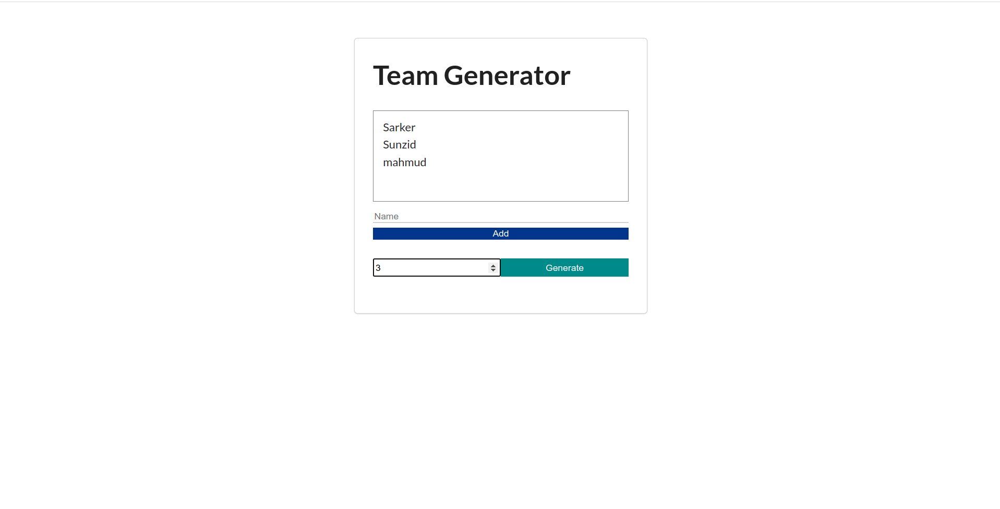
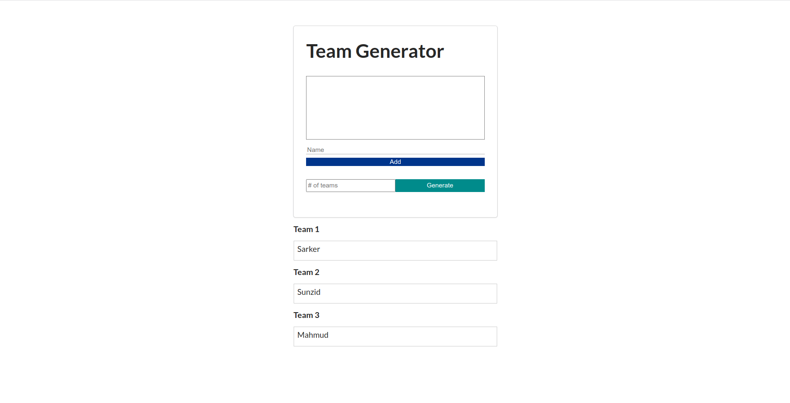

# Team-Generator
Simple SPA where you can add members and generate team based on the members.

## Usage

### Install dependencies

```
npm install
```

### Run Angular server (http://localhost:4200)

```
ng serve
```

### Screenshots

#### 1. Add Members



#### 2. Generate Team


## Tutorial followed 
```
https://www.youtube.com/watch?v=WHv1YQUg6ow
```

